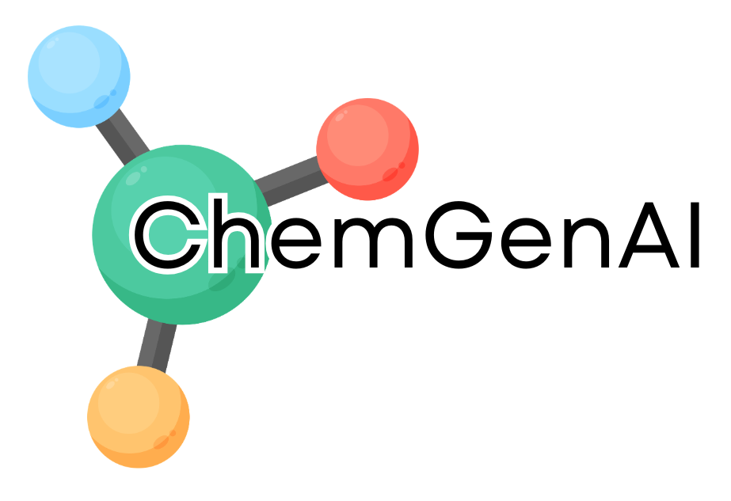

# <p align="center">ChemGenAI</p>

<p align="center">
  
</p>

<p align="center">
  <strong>AI-Powered De Novo Molecular Generation Platform</strong>
</p>

<p align="center">
  <a href="https://github.com/CharithManaujayaMUTEC/ChemGenAI">
    
  </a>
  <a href="https://charithmanujaya1-chemgenai.hf.space">
    
  </a>
  <a href="https://chem-gen-ai-phi.vercel.app/">
    
  </a>
  
  
  
  
</p>

---

# Overview

ChemGenAI is an AI-powered molecular generation platform developed for computational chemistry and early-stage drug discovery research.

The platform employs a Long Short-Term Memory Variational Autoencoder (LSTM-VAE) trained on 20,000 molecular structures from the ZINC database. The model learns a continuous latent representation of chemical space and generates novel molecular structures through probabilistic latent-space sampling, guided by natural-language prompt interpretation.

Each generation request produces a ranked batch of up to 20 candidate molecules. Candidates are validated using RDKit, scored for drug-likeness against Lipinski's Rule of Five, analysed using the **ChemBERTa Transformer model** to obtain contextual molecular embeddings, ranked by a composite score, and persisted to a SQLite database via SQLAlchemy. Results are exposed through a FastAPI REST API and visualised using an interactive React dashboard with both list and gallery views.

The backend is deployed on Hugging Face Spaces using Docker, while the frontend dashboard is deployed on Vercel. The project demonstrates the integration of generative AI, prompt engineering, Transformer-based molecular representation, deep learning, molecular informatics, web technologies, and MLOps practices into a complete AI-powered molecular generation pipeline.

---

# Live Deployment

### Frontend Dashboard

https://chem-gen-ai-phi.vercel.app/

### Backend API

https://charithmanujaya1-chemgenai.hf.space

### Source Code

https://github.com/CharithManaujayaMUTEC/ChemGenAI

---

# Problem Statement

Drug discovery is an expensive and time-consuming process that often requires more than a decade of research and billions of dollars in investment.

One of the major challenges is navigating the enormous chemical search space of potential drug-like compounds. The estimated number of possible drug-like molecules ranges between:

10⁶⁰ – 10¹⁰⁰

Traditional computational methods cannot exhaustively explore this space. Generative AI approaches are increasingly being used in modern drug discovery to efficiently explore chemical space and propose novel molecular candidates.

ChemGenAI addresses this challenge by learning latent molecular representations from real chemical structures, interpreting natural-language prompts to guide generation, and producing ranked batches of novel molecules through latent-space sampling.

---

# Project Objectives

- Learn latent molecular representations using a Variational Autoencoder (VAE)
- Generate novel molecular structures through latent-space sampling
- Support prompt-driven, natural-language-controlled molecular generation
- Validate generated molecules using RDKit
- Evaluate drug-likeness using Lipinski's Rule of Five
- Apply Transformer-based molecular representation using ChemBERTa
- Rank and score generated candidates by composite quality metrics
- Persist generated molecules and properties using SQLite and SQLAlchemy
- Visualize generated molecules through an interactive React dashboard
- Expose molecular generation capabilities through a FastAPI REST API
- Track experiments using MLflow
- Demonstrate an end-to-end MLOps workflow using Docker and Hugging Face Spaces

---

# Key Features

| Feature                      | Description                                                               |
| ---------------------------- | ------------------------------------------------------------------------- |
| De Novo Molecular Generation | Generates up to 20 ranked candidate molecules per request                 |
| Prompt Engineering           | Interprets natural-language prompts into generation parameters            |
| LSTM-VAE Architecture        | Learns molecular representations from SMILES sequences                    |
| RDKit Validation             | Verifies chemical validity of generated molecules                         |
| Property Calculation         | Computes molecular weight, logP, TPSA, H-bond donors/acceptors, and more  |
| Lipinski Rule of Five        | Evaluates drug-likeness and reports specific rule violations              |
| ChemBERTa Analysis           | Generates Transformer-based molecular embedding scores                    |
| Candidate Ranking            | Scores and ranks all generated candidates by composite quality            |
| SQLite Persistence           | Stores generated molecules, properties, and metadata                      |
| Generation History           | Tracks and filters previous molecule generations                          |
| React Dashboard              | Interactive list and gallery views for molecule generation                |
| Molecular Visualization      | Converts SMILES into 2D chemical structures, including thumbnail previews |
| FastAPI Backend              | REST API for inference and data access                                    |
| MLflow Tracking              | Experiment tracking and model management                                  |
| Docker Deployment            | Containerized application deployment                                      |
| Hugging Face Backend         | Cloud-hosted FastAPI service                                              |
| Vercel Frontend              | Public dashboard deployment                                               |

---

# Advanced AI Techniques

| Technique          | Implementation                                                         |
| ------------------ | ---------------------------------------------------------------------- |
| Generative AI      | LSTM Variational Autoencoder                                           |
| Prompt Engineering | Natural-language prompt interpretation (temperature, length, keywords) |
| Transformer Model  | ChemBERTa molecular encoder                                            |
| Cheminformatics    | RDKit property calculation and Lipinski Rule of Five evaluation        |
| Deep Learning      | PyTorch                                                                |
| MLOps              | MLflow + Docker + Hugging Face                                         |

---

# System Architecture

```
User Prompt
      │
      ▼
Prompt Interpretation
      │
      ▼
LSTM-VAE Generator
      │
      ▼
SMILES Generation (up to 20 candidates)
      │
      ▼
RDKit Validation
      │
      ▼
Property Calculation + Lipinski Rule of Five
      │
      ▼
ChemBERTa Transformer
      │
      ▼
Ranking & Scoring
      │
      ▼
SQLite Database
      │
      ▼
FastAPI REST API
      │
      ▼
React Dashboard
```

---

# API Documentation

**Base URL (Production):** `https://charithmanujaya1-chemgenai.hf.space`
**Base URL (Local):** `http://localhost:8000`

| Method | Endpoint    | Description                                                           |
| ------ | ----------- | --------------------------------------------------------------------- |
| GET    | `/`         | API information and version                                           |
| GET    | `/health`   | Health check                                                          |
| GET    | `/ping`     | Connectivity test                                                     |
| POST   | `/generate` | Generate and evaluate up to 20 ranked molecular candidates            |
| GET    | `/history`  | Retrieve previously generated molecules and their computed properties |

### `POST /generate`

**Request**

```json
{
  "prompt": "Generate a highly diverse aromatic drug candidate"
}
```

**Response (200)**

```json
{
  "prompt": "Generate a highly diverse aromatic drug candidate",
  "generated_at": "2026-06-30T10:15:33.511",
  "interpreted_prompt": {
    "temperature": 1.2,
    "max_length": 120,
    "num_candidates": 20,
    "preferred_features": ["aromatic", "drug", "candidate"],
    "keywords": ["diverse", "aromatic", "drug", "candidate"]
  },
  "summary": {
    "generated": 20,
    "valid": 18,
    "drug_like": 15,
    "average_score": 93.42
  },
  "results": [
    {
      "rank": 1,
      "smiles": "CCOc1ccc(C(=O)NCc2ccco2)cc1Cl",
      "valid": true,
      "score": 98.61,
      "chemberta_score": 18.73,
      "properties": {
        "molecular_weight": 323.77,
        "logP": 3.12,
        "tpsa": 41.57,
        "h_bond_donors": 1,
        "h_bond_acceptors": 3,
        "rotatable_bonds": 4,
        "ring_count": 2,
        "heavy_atoms": 22
      },
      "lipinski": {
        "drug_like": true,
        "violation_count": 0,
        "violations": []
      }
    }
  ]
}
```

### `GET /history`

**Response**

```json
[
  {
    "id": 105,
    "smiles": "CCOc1ccc(C(=O)NCc2ccco2)cc1Cl",
    "valid": true,
    "prompt": "Generate a highly diverse aromatic drug candidate",
    "chemberta_score": 18.73,
    "score": 98.61,
    "drug_like": true,
    "molecular_weight": 323.77,
    "logp": 3.12,
    "tpsa": 41.57,
    "h_bond_donors": 1,
    "h_bond_acceptors": 3,
    "rotatable_bonds": 4,
    "ring_count": 2,
    "heavy_atoms": 22,
    "created_at": "2026-06-30T10:16:44.231"
  }
]
```

> **Note:** `/generate` returns all candidates from a single batch, while `/history` returns a flat list of the last 100 individually generated molecules. A natural future enhancement is grouping history by generation session, allowing users to revisit an entire 20-candidate batch alongside its original prompt and summary statistics.

---

# Frontend Dashboard

The React dashboard provides four main views:

| Tab          | Description                                                                                                                          |
| ------------ | ------------------------------------------------------------------------------------------------------------------------------------ |
| **Generate** | Prompt selection, batch generation, ranked list/gallery views, candidate analytics, property panel, and Lipinski violation reporting |
| **Pipeline** | Visual breakdown of the 10-stage generation pipeline and live API reference                                                          |
| **History**  | Filterable, sortable table of all previously generated molecules with full property data                                             |
| **About**    | Platform overview, AI technique summary, and academic context                                                                        |

Generated candidates can be viewed either as a **ranked list** with inline structure thumbnails, or as a **gallery grid** of 2D molecular structure cards — both update a detailed analytics panel showing SMILES, score, ChemBERTa embedding score, validity, drug-likeness, and full RDKit property breakdown for the selected candidate.

---

# Experimental Results

## Training Configuration

| Parameter           | Value            |
| ------------------- | ---------------- |
| Dataset Size        | 20,000 Molecules |
| Epochs              | 15               |
| Embedding Dimension | 128              |
| Hidden Dimension    | 256              |
| Latent Dimension    | 128              |
| Batch Size          | 64               |
| Learning Rate       | 0.001            |

## Training Performance

| Metric                     | Value      |
| -------------------------- | ---------- |
| Final Training Loss        | 0.6056     |
| Latent Space Sampling      | Enabled    |
| RDKit Validation           | Enabled    |
| Lipinski Rule Evaluation   | Enabled    |
| ChemBERTa Transformer      | Integrated |
| Prompt Engineering         | Enabled    |
| SQLite History             | Enabled    |
| FastAPI Deployment         | Successful |
| Hugging Face Deployment    | Successful |
| React Dashboard Deployment | Successful |

The trained LSTM-VAE successfully learns latent molecular representations and generates chemically meaningful molecular structures through latent-space sampling. Candidate batches are further refined through RDKit-based property scoring, Lipinski drug-likeness evaluation, and ChemBERTa Transformer embedding analysis, producing a ranked shortlist of pharmacologically promising candidates per prompt.

---

# Future Enhancements

- Group generation history by session/batch rather than individual molecule
- Fine-tune ChemBERTa for direct property or activity prediction
- Binding affinity estimation
- Toxicity prediction
- Reinforcement Learning-based molecule optimisation
- Conditional VAE for target-specific generation
- Graph Neural Network (GNN) integration
- Transformer-based molecular generation (SMILES-GPT)

---

# Authors

Charith Manujaya

Developed as part of the **EC7203 — Advanced Artificial Intelligence** course project, Department of Computer Engineering, University of Ruhuna.

---

# License

This project is developed solely for academic and research purposes.
